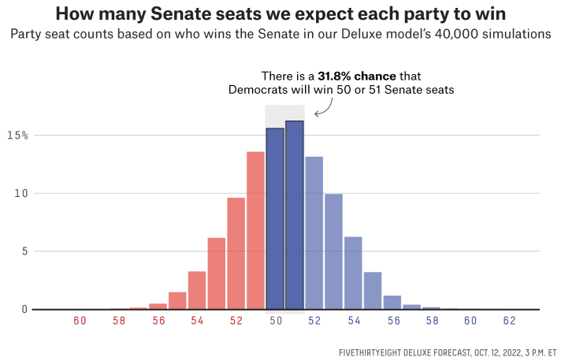
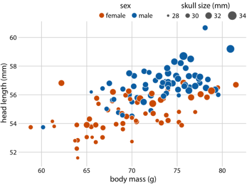

```{r setup, include=FALSE}
  knitr::opts_chunk$set(
    echo = FALSE, 
    eval = TRUE,
    fig.align = 'center'
  )

  library(knitr); library(png)
```
## Instructions
Replicate the plots below to the best of your ability. Try to match *every* element exactly. Please `echo` all code chunks. The chunks must show every step you took and option you specified to generate the plots. Submit in hard copy by March 6. 


## Senate projections
Forecasters at FiveThirtyEight.com published the plot below in [a piece describing their simulations and predictions](https://fivethirtyeight.com/features/52-senators-filibuster/) in advance of the 2022 U.S. midterm elections. 


```{r, out.width="300px", fig.retina=2}
  
```


1. Use the `senate_seat_distribution_2022.csv` data to replicate the plot exactly. The *one exception*: ignore the text grob, arrow, and shading about the chance of Democrats winning 50 or 51 seats. You can read more about the data at the [FiveThirtyEight github repository](https://github.com/fivethirtyeight/data/tree/master/election-forecasts-2022) for their forecast. Your printed plot should be 5 inches wide and 3.5 inches tall.


## Blue Jay data
I love birds. If I could start over, I might choose to study bird behavior instead of human behavior. The plot below shows the relationship between head length and body mass for blue jays. 

```{r, out.width = '200px', retina = 1, fig.cap = "Head length versus body mass for 123 blue jays. The birds' sex is indicated by color, and the birds' skull size by symbol size. Head-length measurements include the length of the bill while skull-size measurements do not. Data source: Keith Tarvin, Oberlin College."}

  

```


2. Use the `blue_jays.rda` data to replicate the plot in full, including the note describing the plot. The final output plot should be 4 inches wide and 3 inches tall.

